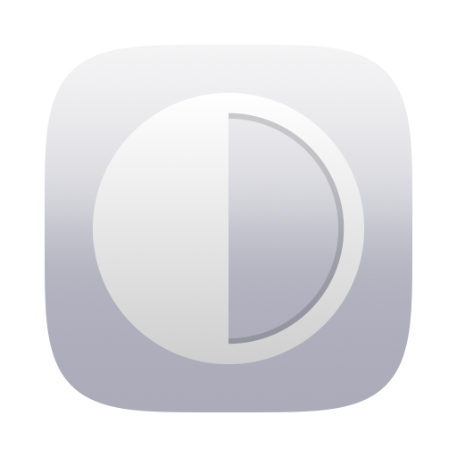

# ThemeSwitch

A tiny macOS menu bar app for switching the system appearance between **Auto**, **Light**, and **Dark**.

macOS has the setting, but it lives in System Settings → Appearance, and Control Center has no module for it. ThemeSwitch puts the same three options one click away.

## Why another dark mode toggle

There are several already. The difference is the third state.

Most menu bar toggles flip between Light and Dark. The ones that do offer an "auto" implement their own — on a schedule, or from ambient brightness — which quietly competes with the setting macOS already has.

ThemeSwitch doesn't reimplement anything. It reads and writes the real system appearance, so **Auto** is macOS's own Auto, with the same sunrise/sunset behavior you'd get from System Settings. The menu is a remote control for the setting, not a replacement for it.

## Install

Requires macOS 13 or later on Apple Silicon. Xcode is not needed — the Command Line Tools are enough.

```bash
git clone https://github.com/salleedesign/ThemeSwitch.git
cd ThemeSwitch
./build.sh
open ThemeSwitch.app
```

Move `ThemeSwitch.app` to `/Applications`, then tick **Open at Login** in its menu so it comes back after a reboot.

The build is ad-hoc signed. That's fine for running your own build, and it's enough for **Open at Login** to register. It is not notarized, so there's no download to hand to someone else — building from source *is* the distribution.

> On Intel, change `-target arm64-apple-macos13.0` in `build.sh` to `x86_64-apple-macos13.0`. Untested.

## How it works

Reading the current appearance is easy. Setting it is not, because the System Events AppleScript dictionary only knows dark-on and dark-off:

```applescript
tell application "System Events" to tell appearance preferences to set dark mode to true
```

There's no way to say **Auto** through it. System Settings drives appearance through SkyLight, a private framework, so ThemeSwitch does the same — four symbols, resolved at run time:

| Symbol | Purpose |
| --- | --- |
| `SLSGetAppearanceThemeSwitchesAutomatically` | Is Auto on? |
| `SLSSetAppearanceThemeSwitchesAutomatically` | Turn Auto on or off |
| `SLSGetAppearanceThemeLegacy` | Is it currently dark? |
| `SLSSetAppearanceThemeLegacy` | Set dark or light |

### What that costs

Worth understanding before you depend on it:

- **A future macOS could rename or drop these symbols.** They're looked up with `dlsym` at run time rather than linked, so the app would still launch, and it falls back to the AppleScript above for Light and Dark. Only Auto would stop working.
- **It can never ship on the Mac App Store.** Review guideline 2.5.1 prohibits private APIs and specifically flags `dlopen`/`dlsym` used to reach them. Complying would mean dropping the private call, which would remove the only reason this app exists.

The whole app is one file, [`Sources/main.swift`](Sources/main.swift), a little over 200 lines. That's deliberate. A free menu bar utility is exactly the shape of software worth being able to read end to end before you install it.

## Development

The icon source is [`Resources/Icon_Art.svg`](Resources/Icon_Art.svg) — full-bleed
art with no mask. [`Resources/make-icon.swift`](Resources/make-icon.swift) insets it
on the canvas, cuts it to the macOS app-icon plate, renders every size natively
rather than downscaling one master, and `iconutil` packs them:

```bash
swift Resources/make-icon.swift
iconutil -c icns Resources/AppIcon.iconset -o Resources/AppIcon.icns
rm -rf Resources/AppIcon.iconset
```

## License

MIT — see [LICENSE](LICENSE).
